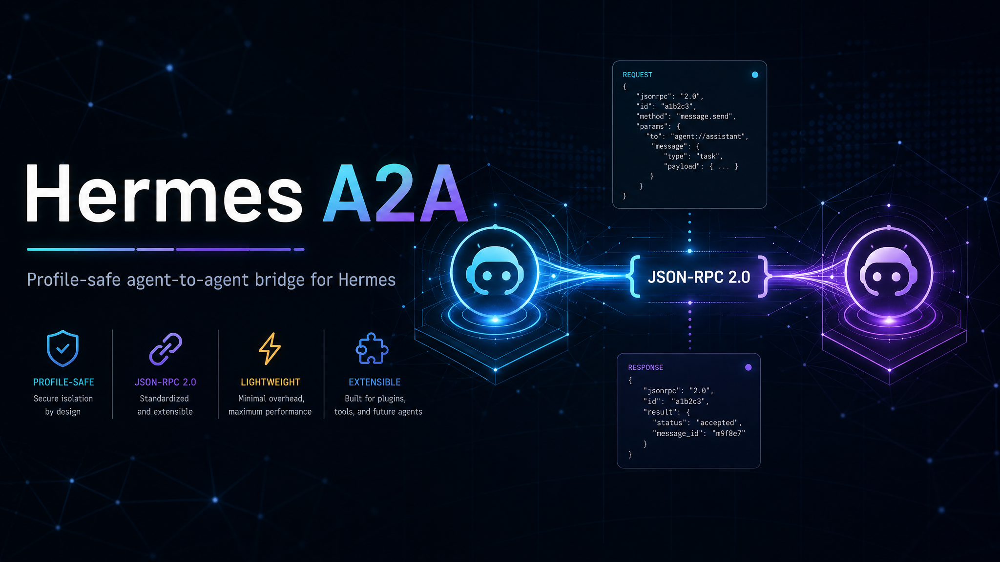

<p align="center">
  
</p>

<h1 align="center">Hermes A2A</h1>

<p align="center">
  Profile-safe Agent-to-Agent bridge for <a href="https://github.com/NousResearch/hermes-agent">Hermes Agent</a>.
</p>

<p align="center">
  <a href="#quick-start">Quick start</a> ·
  <a href="#usage">Usage</a> ·
  <a href="#configuration">Configuration</a> ·
  <a href="#safety-model">Safety</a>
</p>

## What is this?

Hermes A2A lets one Hermes profile talk to another through an A2A-compatible HTTP server and a small set of Hermes tools.

It is built for real multi-profile setups: every agent keeps its own config, ports, tokens, task state, audit logs, and gateway session. No shared global state nonsense.

## Highlights

- Native-ish A2A JSON-RPC support: `SendMessage`, `GetTask`, `CancelTask`.
- Legacy compatibility: `tasks/send`, `tasks/get`, `tasks/cancel`.
- Hermes tools: `a2a_list`, `a2a_discover`, `a2a_call`, `a2a_get`, `a2a_cancel`.
- Background task flow with polling and authenticated push callbacks.
- Profile-local SQLite task store, audit log, and conversation persistence.
- Bearer-token auth for inbound calls and env-based tokens for outbound agents.
- Signed webhook wake into the running Hermes gateway.
- Stale/empty webhook triggers are dropped instead of leaking into Discord or the LLM.
- Installer/update CLI with dry-run, backups, state manifest, and no automatic restart.
- Python standard library runtime for the plugin itself.

## Quick start

Bootstrap the CLI once:

```bash
curl -fsSL https://raw.githubusercontent.com/tickernelz/hermes-a2a/main/scripts/a2a.sh | bash
```

This installs:

```text
~/.local/bin/hermes_a2a
~/.local/share/hermes-a2a/current/
```

If `~/.local/bin` is not in your `PATH`, add it first:

```bash
export PATH="$HOME/.local/bin:$PATH"
```

Then inspect the target profile before changing anything:

```bash
hermes_a2a doctor
hermes_a2a install --dry-run
```

If the plan looks right:

```bash
hermes_a2a install
```

Restart the target Hermes gateway after install. The installer intentionally does not restart anything.

### Install a pinned CLI/source release

```bash
HERMES_A2A_REF=v0.3.3 \
  curl -fsSL https://raw.githubusercontent.com/tickernelz/hermes-a2a/main/scripts/a2a.sh | bash
```

### Target a specific profile

```bash
hermes_a2a install --profile coder --dry-run
```

Or target a profile directory directly:

```bash
hermes_a2a install --hermes-home /path/to/hermes/profile --dry-run
```

### Optional one-line install

If you already know the target is safe, the bootstrap script can install the CLI and then delegate to it:

```bash
curl -fsSL https://raw.githubusercontent.com/tickernelz/hermes-a2a/main/scripts/a2a.sh \
  | bash -s -- install --profile coder --dry-run
```

Without an explicit command, the curl bootstrap only installs the CLI. It does not mutate any Hermes profile.

## Update and uninstall

Update uses the persistent `hermes_a2a` command. It backs up the previous plugin payload and keeps config/env/state intact.

```bash
hermes_a2a update --dry-run
```

Uninstall removes only `plugins/a2a` from the selected profile. Config, secrets, logs, task state, and conversations are preserved so cleanup stays explicit.

```bash
hermes_a2a uninstall --dry-run
```

## Local checkout

```bash
git clone https://github.com/tickernelz/hermes-a2a.git
cd hermes-a2a
./install.sh --dry-run
```

The shell scripts are thin wrappers around the Python CLI:

```bash
python -m hermes_a2a_cli status --profile default
python -m hermes_a2a_cli doctor --profile default
python -m hermes_a2a_cli install --profile default --dry-run
python -m hermes_a2a_cli update --profile default --dry-run
python -m hermes_a2a_cli uninstall --profile default --dry-run
```

## Usage

After restart, the profile exposes:

```text
GET  http://127.0.0.1:41731/health
GET  http://127.0.0.1:41731/.well-known/agent.json
POST http://127.0.0.1:41731/
```

From Hermes, use the A2A tools:

```text
a2a_list                         # list configured agents
a2a_discover(name="coder")       # fetch the agent card
a2a_call(name="coder", message="Review this plan")
a2a_call(name="coder", message="Run this long job", background=true)
a2a_get(name="coder", task_id="...")
a2a_cancel(name="coder", task_id="...")
```

Raw JSON-RPC example:

```bash
curl -X POST http://127.0.0.1:41731/ \
  -H 'Content-Type: application/json' \
  -H 'Authorization: Bearer <token>' \
  -d '{
    "jsonrpc": "2.0",
    "id": "1",
    "method": "SendMessage",
    "params": {
      "message": {
        "kind": "message",
        "role": "user",
        "messageId": "task-001",
        "parts": [{"kind": "text", "text": "Hello from another agent"}]
      }
    }
  }'
```

Native-style responses are wrapped as `result.task` or `result.message`. Legacy callers keep the legacy task result shape.

## Configuration

Hermes A2A is config-first. New installs write a canonical `a2a` block in `config.yaml`; `.env` is only for advanced secret references or unrelated Hermes provider/platform keys.

```yaml
a2a:
  enabled: true
  identity:
    name: primary_agent
    description: Primary Hermes A2A profile
  server:
    port: 41731
    auth_token: "[REDACTED]"
  wake:
    port: 47644
    secret: "[REDACTED]"
    session_ref:
      platform: discord
      chat_id: "<discord-channel-or-thread-id>"
  agents:
  - name: coder
    url: http://127.0.0.1:41732
    description: Coding Hermes profile
    auth_token: "[REDACTED]"
    enabled: true
    tags: [local]
    trust_level: trusted
```

A2A wake routing is intentionally minimal in canonical config. `wake.session_ref` anchors the target Hermes gateway session, and installer/migration resolves the verbose `chat_type`, `thread_id`, `actor.id`, and `actor.name` from Hermes session history when it generates webhook compatibility routes.

The installer still generates Hermes webhook compatibility sections (`webhook.extra.routes` and `platforms.webhook.extra.routes`) from `a2a.wake.session_ref`, but those are internal generated config. Edit the canonical `a2a` block or rerun the wizard/migration instead of hand-editing `deliver`/`source`.

To convert an old env-heavy install:

```bash
hermes_a2a migrate config-unify --profile default --dry-run
hermes_a2a migrate config-unify --profile default --yes
```

Advanced secret-store mode can use env references instead of inline config secrets:

```yaml
a2a:
  server:
    auth_token_env: A2A_AUTH_TOKEN
  wake:
    secret_env: A2A_WEBHOOK_SECRET
  agents:
  - name: coder
    auth_token_env: A2A_AGENT_CODER_TOKEN
```

Bootstrap variables such as `HERMES_A2A_REF`, `HERMES_A2A_REPO`, `HERMES_A2A_INSTALL_DIR`, and `HERMES_A2A_BIN_DIR` still control how the persistent CLI is installed.

## Background tasks

Background mode is for long-running agent work.

```text
a2a_call(name="coder", message="Audit this repo", background=true)
```

The caller gets a task id immediately. Later it can poll:

```text
a2a_get(name="coder", task_id="...")
```

If a trusted callback URL is supplied, native calls include `configuration.pushNotificationConfig` with a generated per-task token. The callback must present that token through `X-A2A-Notification-Token`. Duplicate terminal updates are ignored, so late notifications cannot overwrite completed, failed, or canceled tasks.

## Safety model

| Layer | Behavior |
| --- | --- |
| Profile isolation | All state resolves under the selected Hermes profile. |
| Inbound auth | Bearer token required when auth is enabled. |
| Outbound auth | Remote tokens are read from env vars, not inline config. |
| Direct URLs | Blocked by default; configured agent names are preferred. |
| Webhook wake | Signed and resolved by task id; raw webhook text is never trusted as message content. |
| Stale triggers | Dropped before they reach Discord or the LLM. |
| Attachments | URLs/files are represented as sanitized references; remote files are not fetched automatically. |
| Persistence | SQLite task state and logs are profile-local and capped/redacted where needed. |
| Rate limits | Inbound POSTs are rate-limited per remote address. |

## Installed files

The curl bootstrap writes the persistent CLI here:

```text
~/.local/bin/hermes_a2a
~/.local/share/hermes-a2a/current/
```

The plugin installer writes only to the selected profile:

```text
$HERMES_HOME/plugins/a2a/
$HERMES_HOME/a2a/state.json
$HERMES_HOME/a2a/backups/
$HERMES_HOME/a2a_tasks.sqlite3
$HERMES_HOME/a2a_audit.jsonl
$HERMES_HOME/a2a_conversations/
```

It also updates the selected profile's `config.yaml` and `.env` after creating backups. It never restarts Hermes.

## Development

```bash
bash -n install.sh
bash -n uninstall.sh
bash -n scripts/a2a.sh
python -m py_compile hermes_a2a_cli/*.py hermes_a2a_cli/migrations/*.py plugin/*.py dashboard/plugin_api.py tests/*.py
python -m pytest -q
git diff --check
```

Use the same Python environment Hermes uses if your system Python does not have the test dependencies.

## Limitations

- No SSE streaming yet.
- Agent-card skills are static.
- Uninstall preserves config, env, logs, and state by design.
- This is a bridge for Hermes profiles, not a sandbox boundary. Treat remote agent output as untrusted.

## License

MIT License. Copyright (c) 2026 Zhafron Adani Kautsar.

## Continuity note

This fork continues work from [`iamagenius00/hermes-a2a`](https://github.com/iamagenius00/hermes-a2a), with additional profile isolation, native/background A2A support, installer lifecycle, security hardening, and live multi-profile verification.
